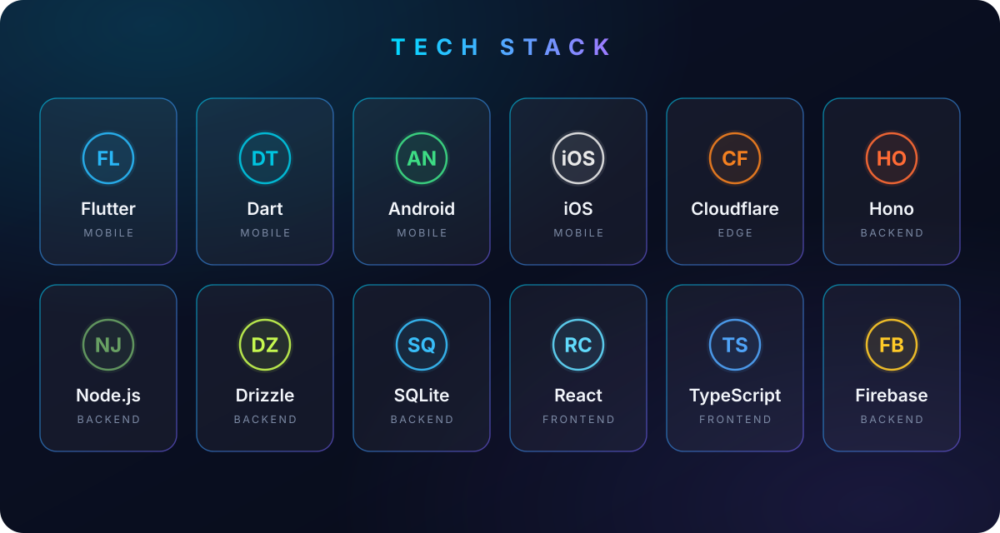

<!-- Animated wave header -->


<div align="center">
  
</div>

<div align="center">

[](https://github.com/malikhaider1)
[](https://github.com/malikhaider1)


</div>

---

### 👨‍💻 About Me

<div align="center">
  <i>Full-stack developer turning ideas into shipped products — from the first sketch to the App Store, the API, and the website behind it.</i>
</div>

<br>

```yaml
name: Malik Haider
based_in: Pakistan 🌍 (working worldwide)
role: Full-Stack Developer
mobile: Flutter → iOS & Android
backend: Cloudflare Workers, Hono, Node.js, Drizzle ORM, SQLite (D1)
frontend: React, TypeScript
currently_building: AI-powered mobile experiences on the edge
learning: Advanced Cloudflare stack & LLM integrations
open_to: Freelance projects, collaborations, full-product builds
```

- 🔭 **What I do:** Design, build, and ship complete products — the app you tap, the API it talks to, and the website around it
- 🧠 **How I work:** Clean architecture, typed APIs, and UI that feels effortless — no shortcuts on quality
- 🌱 **Right now:** Deep into Cloudflare's edge stack (Workers + D1) and weaving AI features into mobile apps
- 👯 **Let's collaborate:** If it involves mobile apps, backends, or a full product build — I'm interested
- 💬 **Ask me about:** Flutter, Cloudflare Workers & D1, Hono, Drizzle ORM, React, getting through App Store review
- ⚡ **Fun fact:** I've survived real App Store rejections and lived to document every lesson

---

### 🛠️ Tech Stack

<div align="center">
  
</div>

---

### 📊 Stats & Activity

<div align="center">
  
</div>

<div align="center">
  
  
</div>

<div align="center">
  
  
</div>

<div align="center">
  
</div>

---

### 🏆 GitHub Trophies

<div align="center">
  
</div>

---

<div align="center">

### 💭 Quote of the Day


</div>

<!-- Animated wave footer -->

